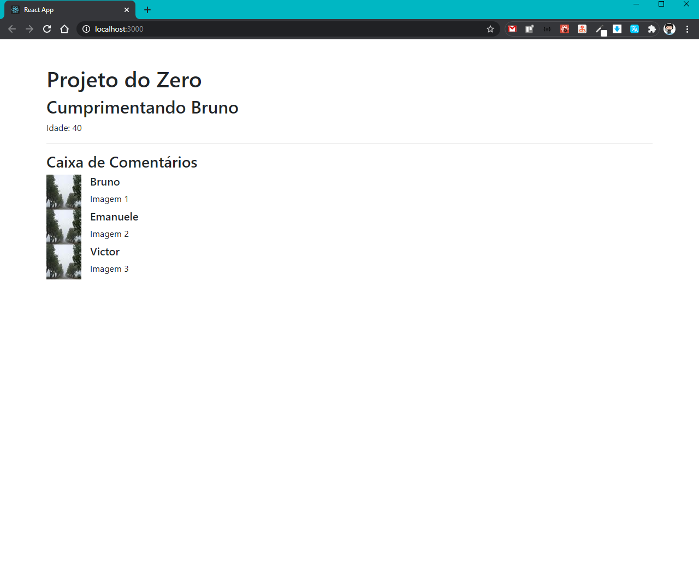
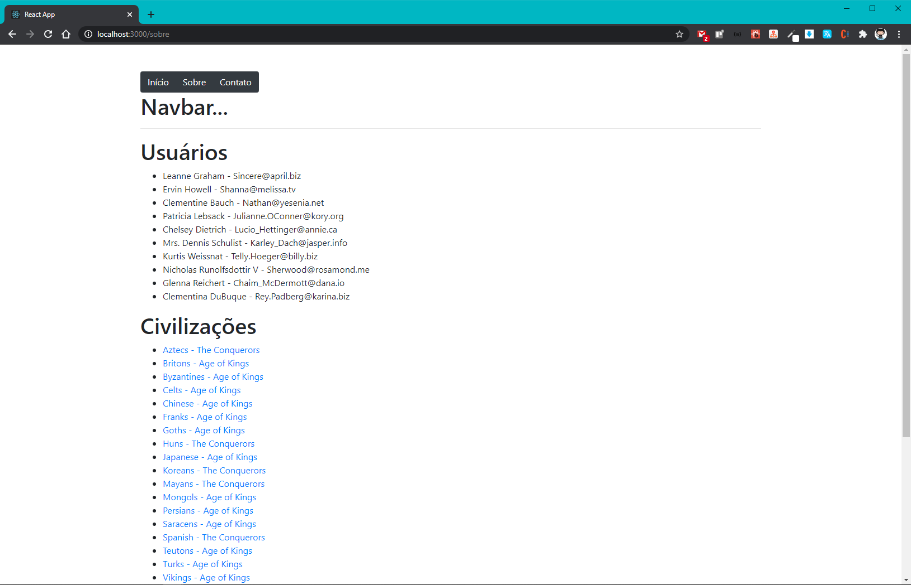
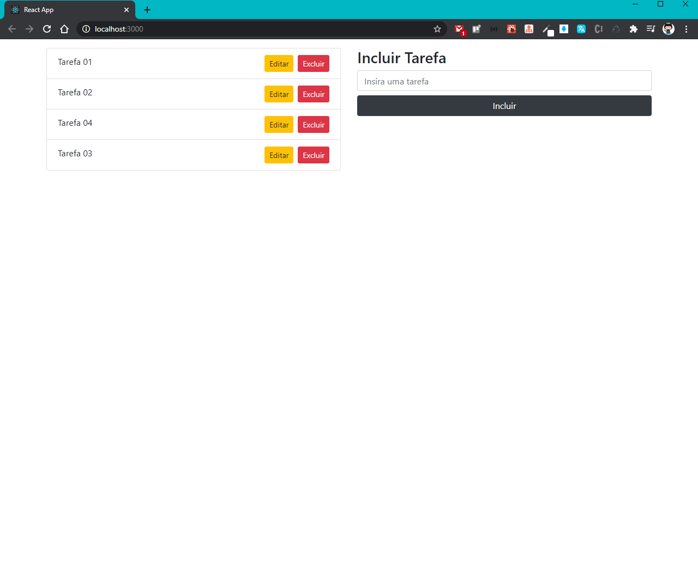

# Curso : React JS ⭐Desde Cero! Hooks, Redux, Context, Firebase y más!

<h2 align="center">
    
</h2>

> Ultima Aula Assistida : 45

### Seção 1 : Introdução

### Seção 2 : Fundamentos de Javascript

### Seção 3 : React Fundamentos

<!-- Seção 4 : CRUD HOOKS - Prática ( FINALIZADO ) -->
<h3 align="left">
   Seção 4 : CRUD HOOKS - Prática ( FINALIZADO )
</h3>
<p align="center">
    Esta aplicação de CRUD foi desenvolvida usando arrays e hooks para manipulação de dados em memória apenas, não utiliza banco de dados.
</p>
<h2 align="center">
    
</h2>

```bash
# Pasta do Projeto
|- projeto-1
  |- crud-simples-udemy

# Clone este repositório
$ git clone https://github.com/brunoemferreira/React-JS-Desde-Cero-Hooks-Redux-Context-Firebase-y-m-s.git

# Acesse a pasta do projeto no terminal/cmd
$ cd projeto-1

# vá para a pasta crud-simples-udemy
$ cd crud-simples-udemy

# Instale as dependências
$ npm install

# Execute a aplicação
$ npm start

# O aplicação iniciará na porta:3000 - acesse <http://localhost:3000>
```

<!-- Seção 5 : PROPS - Cominicação entre componentes ( FINALIZADO ) -->
<h3 align="left">
   Seção 5 : PROPS - Cominicação entre componentes ( FINALIZADO )
</h3>
<p align="center">
    Esta aplicação foi desenvolvida para estudo da comunicação entre componentes utilizando props 
</p>
<h2 align="center">
    
</h2>

```bash
# Pasta do Projeto
|- projeto-1
  |- props-udemy-1

# Clone este repositório
$ git clone https://github.com/brunoemferreira/React-JS-Desde-Cero-Hooks-Redux-Context-Firebase-y-m-s.git

# Acesse a pasta do projeto no terminal/cmd
$ cd projeto-1

# vá para a pasta crud-simples-udemy
$ cd props-udemy-1

# Instale as dependências
$ npm install

# Execute a aplicação
$ npm start

# O aplicação iniciará na porta:3000 - acesse <http://localhost:3000>
```

<!-- Seção 6 : REACT ROUTER - Rotas ( FINALIZADO ) -->
<h3 align="left">
   Seção 6 : REACT ROUTER - Rotas ( FINALIZADO )
</h3>
<p align="center">
    Esta aplicação foi desenvolvida para estudo de Rotas e consultas em APIS de Terceiros.
</p>
<h2 align="center">
    
</h2>

```bash
# Pasta do Projeto
|- projeto-1
  |- router-2

# Clone este repositório
$ git clone https://github.com/brunoemferreira/React-JS-Desde-Cero-Hooks-Redux-Context-Firebase-y-m-s.git

# Acesse a pasta do projeto no terminal/cmd
$ cd projeto-1

# vá para a pasta crud-simples-udemy
$ cd router-2

# Instale as dependências
$ npm install

# Execute a aplicação
$ npm start

# O aplicação iniciará na porta:3000 - acesse <http://localhost:3000>
```

<!-- Seção 7 : -->

<h3 align="left">
   Seção 7 : CRUD FIRESTORE - Base de Dados Firebase ( FINALIZADO )
</h3>
<p align="center">
     Esta aplicação de CRUD foi desenvolvida usando o Banco Firestore para manipulação de dados.
</p>
<h2 align="center">
    
</h2>

```bash
# Pasta do Projeto
|- projeto-1
  |- crud-firestore

# Clone este repositório
$ git clone https://github.com/brunoemferreira/React-JS-Desde-Cero-Hooks-Redux-Context-Firebase-y-m-s.git

# Acesse a pasta do projeto no terminal/cmd
$ cd projeto-1

# vá para a pasta crud-simples-udemy
$ cd crud-firestore

# Instale as dependências
$ npm install

# Execute a aplicação
$ npm start

# O aplicação iniciará na porta:3000 - acesse <http://localhost:3000>

# Para essa aplicação é necessário possuir um email no google para ter acesso a todo Ecossistema do Firebase
```

<!-- Seção 8 : AUTH - Rutas Protegidas:
Autenticación con Firebase -->

<h3 align="left">
   Seção 8 : AUTH - Rotas Protegidas: Autenticação com Firebase 
</h3>
<p align="center">
     Texto
</p>
<h2 align="center">
    
</h2>

```bash
# Pasta do Projeto
|- projeto-1
  |- crud-firestore

# Clone este repositório
$ git clone https://github.com/brunoemferreira/React-JS-Desde-Cero-Hooks-Redux-Context-Firebase-y-m-s.git

# Acesse a pasta do projeto no terminal/cmd
$ cd projeto-1

# vá para a pasta crud-simples-udemy
$ cd crud-firestore

# Instale as dependências
$ npm install

# Execute a aplicação
$ npm start

# O aplicação iniciará na porta:3000 - acesse <http://localhost:3000>

# Para essa aplicação é necessário possuir um email no google para ter acesso a todo Ecossistema do Firebase
```

<!-- Seção 9 : -->

<!-- Seção 10 -->

<!-- Seção 11 -->

<!-- Seção 12 -->

<!-- Seção 13 -->

<!-- Seção 14 -->

<!-- Seção 15 -->

<!-- Seção 16 -->

<!-- Seção 17 -->

<!-- Seção 18 -->

<!-- Seção 19 -->

<!-- Seção 20 -->
